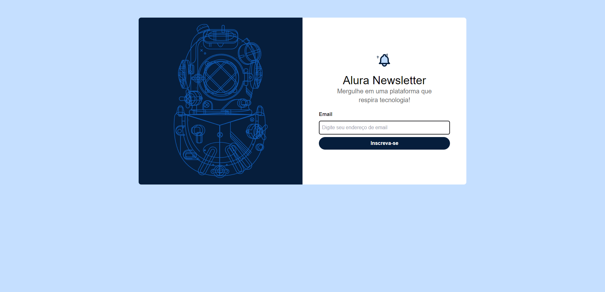
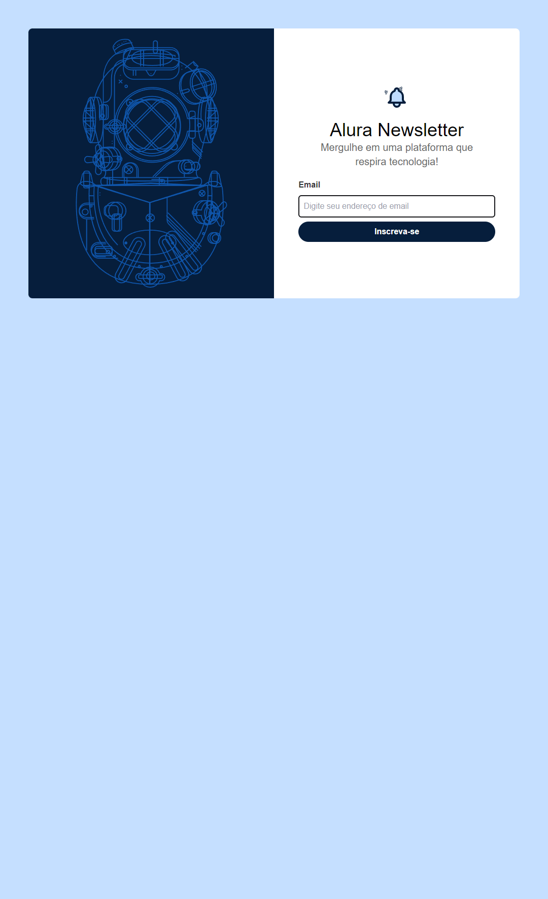
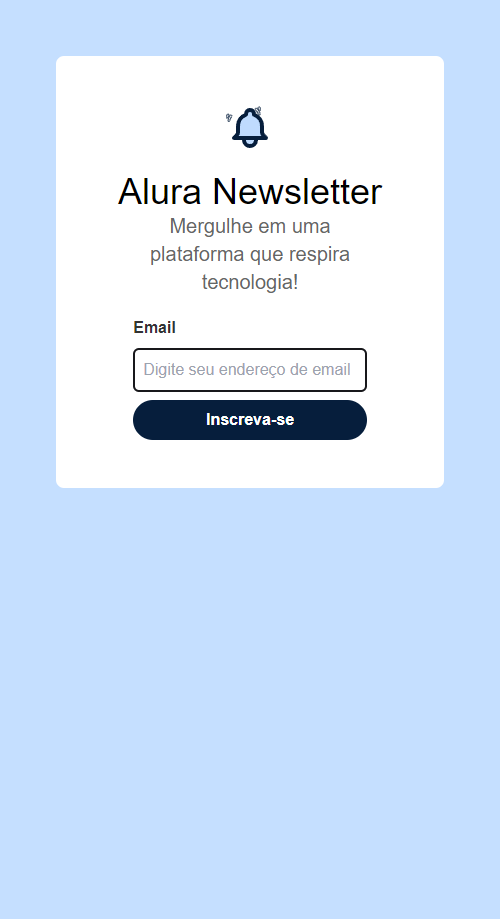

# Newsletter feito com Tailwind CSS

   

   

  

# :pushpin: Conteúdo

- [Newsletter feito com Tailwind CSS](#newsletter-feito-com-tailwind-css)
- [:pushpin: Conteúdo](#pushpin-conteúdo)
    - [Preview](#preview)
- [:computer: Tecnologias](#computer-tecnologias)
- [:computer: Autores](#computer-autores)
- [:closed_book: Licença](#closed_book-licença)

### Preview

    <video width="320" height="240" controls="controls" autoplay="autoplay">
    <source src="./image/screencast-avatars.githubusercontent.com-2022.05.07-16_00_00.webm" type="video/mp4">
    <object data="" width="320" height="240">
    <embed width="320" height="240" src="./image/screencast-avatars.githubusercontent.com-2022.05.07-16_00_00.webm">
   
   
   

# :computer: Tecnologias

Este projeto foi feito utilizando as seguintes tecnologias:

- [Tailwind](https://tailwindcss.com/)
- [CSS]()

# :computer: Autores

<table>
  <tr>
    <td align="center">
      <a href="http://github.com/tavareshenrique/">
        
         
        
          <b>Lucas Ferreira</b>
        
       </a>
        
       <a href="https://www.linkedin.com/in/lucasfpnt/" title="Linkedin">@lucasfpnt</a>
        
       <a href="https://www.linkedin.com/in/lucasfpnt/" title="Code">💻</a>
    </td>
    <td align="center">
      <a href="http://github.com/lucasf5/">
        
         
        
          <b>Alura</b>
        
       </a>
        
       <a href="https://github.com/alura-cursos" title="Linkedin">@Alura</a>
        
       <a href="" title="Creators">🚀</a>
    </td>
  </tr>
</table>

# :closed_book: Licença

Este projeto está sob a licença [MIT](./LICENSE).

